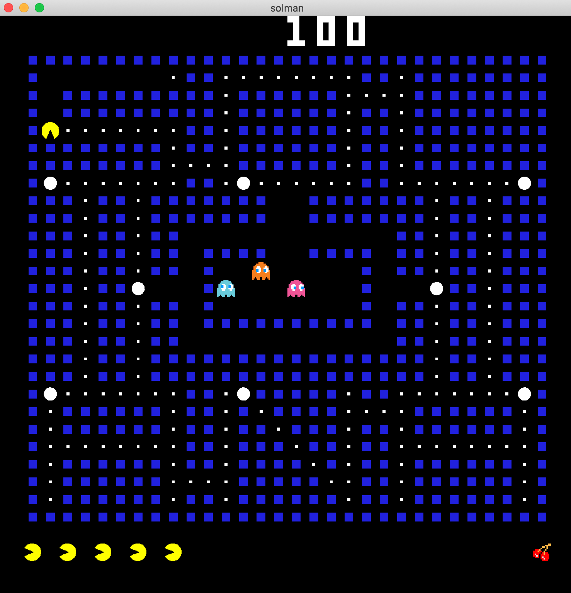

# sol-man
Inspired by some of the work done already, creating a simple pac man style eat the block game for sol

## running
```
cargo run --release --bin sol
```

## key bindings
vim keys or arrow keys for movement

:arrow_up: to move up

:arrow_down: to move down

:arrow_left: to move left

:arrow_right: to move right

`p` to pause

`q` to quit
